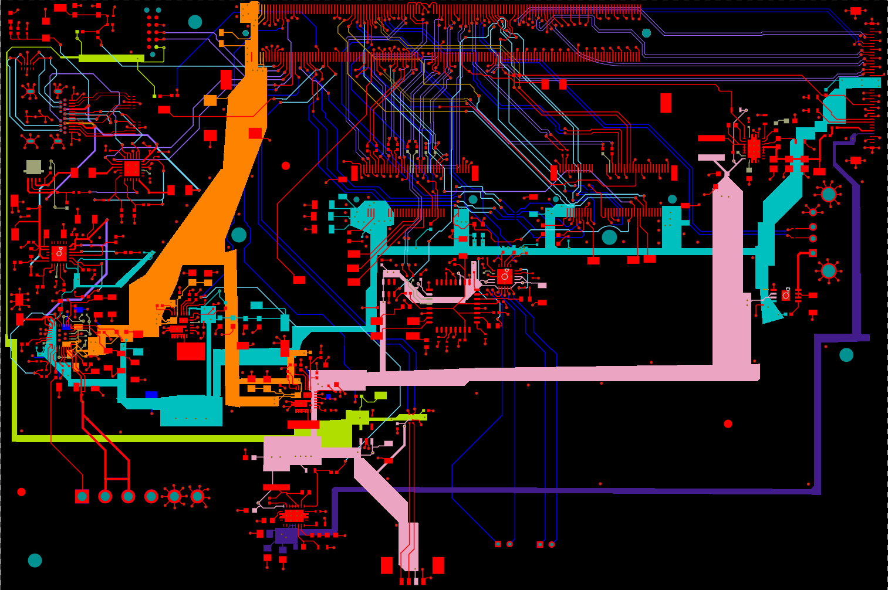
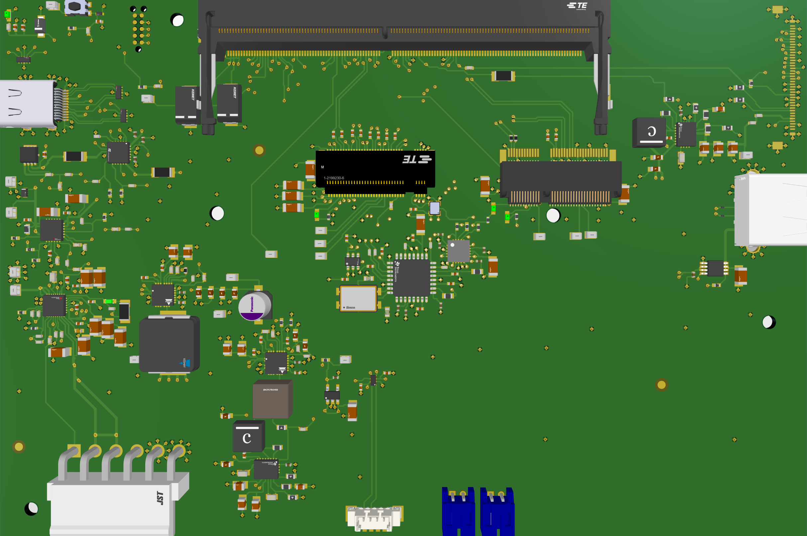

8-Layer High-Speed PCB | NVIDIA Jetson Orin NX | Full Custom Laptop Motherboard

Author: Evan King
Status:  Revision A — Routing Complete, Pre-Fabrication
Tech Stack: Altium Designer • Jetson Linux • dtc/dtcpp • LPDDR5 SoM • eDP • M.2 • DCDC/PDN

Top view:

3D view:

### Schematics

Full schematics (PDF):  
[Download here](docs/orin_nx_schematics.pdf)

    **Overview**
This repository contains the full schematic and 8-layer PCB layout of a custom laptop motherboard designed around the NVIDIA Jetson Orin NX System-on-Module.

The goal is to build a fully custom laptop, inspired by the anyon_e project, while focusing on:

High-speed digital design

Controlled impedance routing

Embedded power delivery

Display interface design (eDP)

USB, UART, and M.2 storage integration

Professional PCB workflow in Altium Designer

Deep understanding of carrier-board engineering

This project represents two months of self-directed learning, built from scratch using datasheets, open-source carrier boards, Phil’s Lab videos, and NVIDIA's official documentation.

    *Why?*
I built this project to challenge myself with something far beyond typical coursework.

I wanted to learn:

How modern laptop motherboards are engineered

How to design high-speed interfaces correctly

How to read and interpret complex reference schematics

How to design real power systems (buck converters, PDN)

How to route differential pairs and maintain signal integrity

How to create a board that could actually be manufactured

This project is completely self-taught — no courses or lab templates.
I learned everything through:

Phil’s Lab (YouTube)

Inspiration from ANYON_E open-source laptop

NVIDIA developer documentation

Open-source carrier board 

Datasheets, design guides, errata sheets

Trial, error, fixing mistakes, and learning from them

Rev A — What Is Done
 Complete schematic
 8-layer PCB routed
 DRCs passed
 eDP routed & impedance-matched
 Power delivery network designed
 USB2 subsystem routed
 PCIe for WIFI/BT and SSD
 STM32G0 embedded controller footprint integrated
 Project compiles cleanly in Altium

